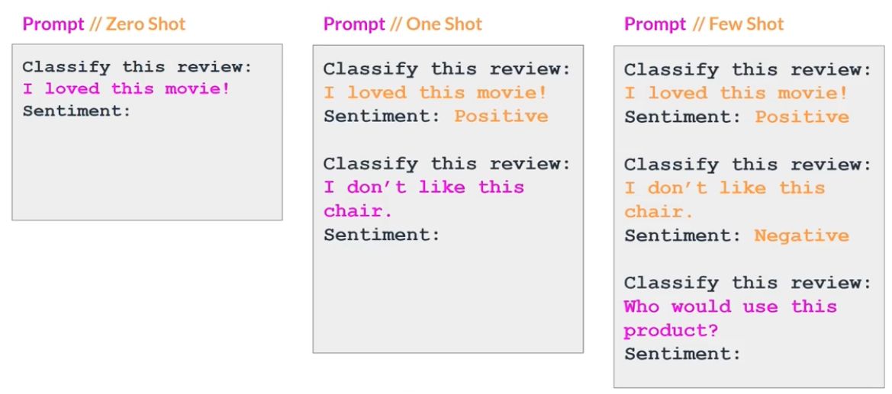

# Generative AI with Large Language Models

---

Course link: https://www.deeplearning.ai/.

---

---

# Week 1

> Understand the transformers architecture and its specificities for LLMs. Discuss the GenAI project life cycle.
> 

## Introduction to LLMs and the generative AI project lifecycle

### Generative AI & LLMs

- models that mimic or simulate humans
    - foundations models created from trillions of words and sentences written by humans
    - LLMs == purple circles
    - use of FLAN-T5 in this course
    - multiple modalities are available, but we’ll use NLP specifically in this course
        - prompting, fine-tuning, deployment
- prompts and completion
    - prompt: text you enter
        - context window
    - model: predicts the next word
    - completion: generates an answer
        - inference

### LLM use cases and tasks

- next-word prediction
    - from basic chatbots to multiple other tasks (essay writing, discussion summarization, translation, coding, named entity extraction, information retrieval, connection to external data sources or APIs, …)
- scale
    - more parameters means better understanding of language
    - fine-tuning small models can also prove efficient

### Text generation before transformers

- RNNs
    - to work better, RNNs needed to see more words in front of the one to predict (similar to context window?) ⇒ lots of resources needed
    - performance was not great because the model needs to understand more context about the sentence / document
    - words can also have multiple meanings → (syntactic) ambiguity
- attention is all you need & transformers
    - scales efficiently
    - parallel processing
    - attention to input meaning

### Transformers architecture

- transformers are able to learn all the context of a sentence
    - attention weights to each word to each other word
    - learned during training ⇒ **attention map**
    - self-attention

- transformers architecture
    - encoder + decoder
    - tokenization of the words input
        - convert to numbers
        - use token IDs
        - use the same tokenizer all over the process
    - embedding token as multi-dimensional vectors
        - gets the meaning of individual tokens into the model
            - used in word2vec already
    - positional encoding
        - self-attention reflects the importance of each word to each other words
        - multi-headed self-attention
            - each head will learn a different aspect of language
                - eg: activity of the sentence, other properties such as rhymes
    - feed forward network
        - vector of logit (prob score for each word)
    - softmax layer

### Generating text with transformers

- translation task: sequence-to-sequence
- steps: tokenization → embedding → attention layers → feed forward network → generate output from decoder → softmax output
- encoder & decoder
    - the encoder understands a deep representation of the language used
    - the decoder uses this understanding on the input data to produce new tokens
- encoder only models
    - input and output have same length
    - uses: classification (sentiment analysis)
    - eg: Bert
- encoder-decoder models
    - sequence-to-sequence (different lengths)
    - scale up to perform generation tasks
    - eg: Bart, T5 (used here)
- decoder only models
    - generalizes to most tasks if scaled up
    - eg: GPT, Llama

### Transformers: Attention is all you need

- goal: potentially replace RNNs and CNNs
- link to the article: https://arxiv.org/html/1706.03762v7.

### Prompting and prompt engineering

- prompt → model → completion
    - context window
- prompt engineering
    - in-context learning (ICL): include examples in the prompt
        
        
        
        - zero shot inference: no filled example, more like a template (**bigger models**)
        - one shot inference: one filled example (sample review + sentiment analysis eg), template for the next one to be filled
        - few shot inference: multiple samples + template to fill
            - use no more than 5 or 6 examples ⇒ if needed, fine-tune it
    - models with more parameters understand language better ⇒ are better at zero shot inference

### Generative configuration

- set of configuration parameters can modify the inference behavior
    - `max new tokens`: limit nb of tokens generated
    - `greedy 🆚 random sampling`
        - greedy form decoding: model always chooses the word with the highest probability
        - random(-weighted) sampling: random selection based on prob distribution
            - reduces likelihood for a word to be repeated
            - increases risks of hallucinations
    - `top-k and top-p`: increase random sampling but helps with accuracy
        - top-k: reduce the number of tokens possible to choose from, even when random sampling is there ⇒ you first select `k` tokens, then random sample
        - top-p: eg: if p=0.3, only the tokens that add up to 0.3 are selected then randomly sampled
    - `temperature`: influences the shape of the prob distribution of the next token
        - higher the temp, higher the randomness
        - low value (<1): prob distribution is concentrated on a smaller number of words ⇒ more deterministic?
        - high value (>1): broader, flatter prob distribution ⇒ more randomness and variability (seems more creative)

### Generative AI project lifecycle

- Scope: define scope as narrowly as possible
    - LLM abilities depends strongly on the model chosen → define tasks accurately to choose correctly
- Select
- Adapt and align model: assess performance and eventually train model a bit more
- Application integration

### Introduction to AWS labs

### Lab 1 walkthrough

## LLM pre-training and scaling laws

### Pre-training large language models

- focus on the Select part of the genAI LC
- choosing a model: foundation model 🆚 building your own
    - model hub & model cards
- model architecture & pre-training objectives
    - data → data quality → pre-training on embeddings
    - encoders only 🆚 encoders-decoders 🆚 decoders only
        - autoencoding models (encoders only): reconstruct text using masks for training
            - sentiment, analysis, NER, word classification
            - eg: Bert, Deberta
        - autoregressive models (decoders only): predict next token
            - text gen, other emergent behavior (depends on model size)
            - eg: GPT, Bloom
        - sequence-to-sequence models (encoders-decoders)
            - translation, text summarization, question answering
            - eg: T5, Bart
- significance of scale: task abiliy: size matters 🦝🧑‍🚀

### Computational challenges of training LLMs

- CUDA
- quantization
    
    
    
    - reduce precision of model from 32 to 16 bit floating points
    - FP16 🆚 BF16 (truncated FP32)
        - in the latter, the exponent keeps 8 bits
    - INT8

### Efficient multi-GPU compute strategies

- distributed compute needed for bigger models, but also useful in other situations to improve speed
- distributed data parallel (DDP)
    
    
    
- fully sharded data parallel (FSDP)
    
    
    
    
    
    - ZeRo paper
    - distribute params, gradients, and optimizer states across GPUs
    - supports offloading to CPU if needed
    - sharding is configurable

### Scaling laws and compute-optimal models

- scaling choices for pre-training
    - goal: maximize model performance (minimize loss)
        - scaling choice: dataset size (nb of tokens) 🆚 model size (nb of params)
- compute budget
    - petaflop/s-day
    - chinchilla paper

### Pre-training for domain adaptation

- optimal performance / size is the purple zone
    
    
    

# Week 2

## Fine-tuning LLMs with instruction

## Parameter efficient fine-tuning